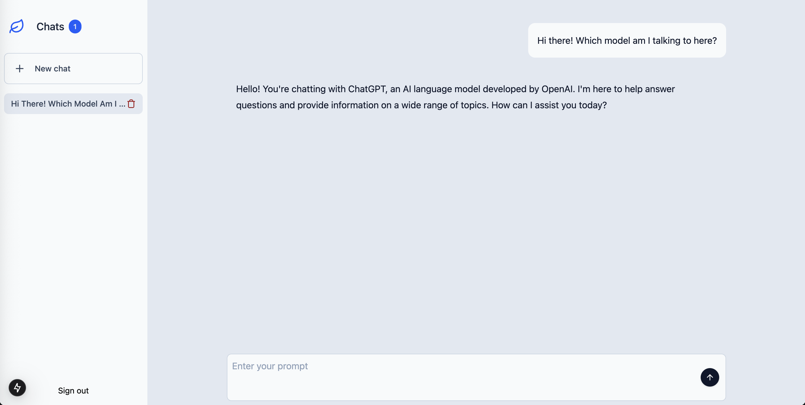

# Chat Example

An example chat app using NextJS, Convex and Tailwind.



View live at [https://chat-example-nextjs-convex.vercel.app](https://chat-example-nextjs-convex.vercel.app)

## Local Development

- Create a convex account (and project) and login: `npx convex login`
- Install: `npm i`
- Setup convex auth: `npx @convex-dev/auth`
- Create keys for auth, and then copy-paste the entire output into Convex Environment Variables (in the dashboard):

```
node generateKeys.mjs
```

- Add `.env.local` :

```markdown
# Deployment used by `npx convex dev`

# convex

CONVEX_DEPLOYMENT=dev:superb-lobster-418 # replace with your convex project-environment name
NEXT_PUBLIC_CONVEX_URL=https://superb-lobster-418.convex.cloud # replace with your convex project-environment name
SITE_URL=http://localhost:3000

# openai chatgpt

OPENAI_API_KEY=sk-proj-...
```

- Start local server: `npm run dev`

## Deployment

- Create a vercel account and link to your chat-example github repo
- Use the following for the build command:

```bash
if [ "$VERCEL_ENV" = "production" ]; then npx convex deploy --cmd 'next build' && npx convex run migrations:runAll --prod; else npm run build; fi
```

- Add `CONVEX_DEPLOYMENT`, `NEXT_PUBLIC_CONVEX_URL` and `SITE_URL` environment variables to vercel
- Add all environment variables from `.env.local` to your convex project environment
- Commit to github to trigger a build in vercel
